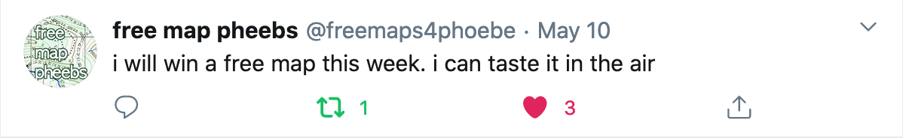

# Building A Map-Winning Robot
## *with Python and tweepy*

This easy-to-build bot utilizes Twitter API to enter the US Geological Survey's weekly map giveaway on Twitter, #FreeMapMonday. 
It also tweets despondently upon losing on Tuesdays, and tweets in anticipation of imminent victory on Sundays. It can run straight from an IDE or the command line, or be automated (I used Mac's built-in Automator app.)

## Known Bugs:

I have not won any maps yet. 